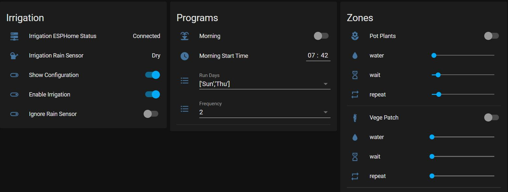
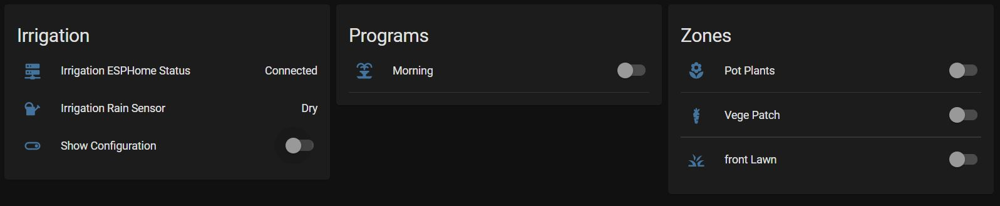

# irrigation_component_v2
The driver for this project is to provide an easy to configure user interface for the gardener of the house. The goal is that once the inital configuration is done all the features can be modified through lovelace cards. To further simplify things there are conditions in Lovelace example to hide away the configuration items.

# Irrigation
 


All the inputs of the new platforms are Home Assistant entities for example the start time is provided via a input_date_time entity. The information available is used to define a template internally that is evaluated to trigger the irrigate action according to the inputs provided.

Watering can occur in an Eco mode where a water/wait/repeat cycle is run to minimise run off by letting water soak as a by using several short watering cycles.

The rain sensor is implemented as a binary_sensor, this allows a components to suspend the irrigation. Additionally being implemented as a switch you can also start a program or zone based on any automation. There is also the ability to ignore the rain sensor at the program or zone level so sheltered areas can be watered even if the rain sensor has been activated.

Only one program or zone can run at a time to prevent multiple solenoids being activated. If program start times result in an overlap the running program will be stopped.

The solution is two custom components implemeting new switch platform types:
* irrigationprogram - to represent a program
  - The irrigation entity stores the last run day.
  - The list of zones to run in this program.
  - binary sensor definition for a rain sensor
* irrigationzone - to represent zones
  - The irrigation_zone provides the link to a switch entity to control a solenoid.
  - The length of time to water.
  - Has attribute defining remaining run time.

## INSTALLATION
### To create a working sample
* Copy the irrigationprogram and irrigationzone folders to the ‘config/custom components/’ directory 
* Copy the 'irrigation.yaml' file to the packages directory or into configuration.yaml
* Copy the 'dummyzones.yaml' file to the packages directory of into configuration yaml. This will provide dummy implementation of switches to represent solenoids.
* Restart Home Assistant
* In Lovelace create a 'manual' card and copy the contents of the 'lovelace.yaml' file

## CONFIGURATION

### Example configuration.yaml entry
```yaml
  switch:
  - platform: irrigationprogram
    switches: 
      morning:
        friendly_name: Morning
        irrigation_on: input_boolean.irrigation_on
        start_time: input_datetime.irrigation_morning_start_time
        run_freq: input_select.irrigation_freq
        rain_sensor: binary_sensor.irrigation_rain_sensor
        ignore_rain_sensor: input_boolean.irrigation_ignore_rain_sensor
        icon: mdi:fountain
        zones:
          - zone: switch.pot_plants
          - zone: switch.front_lawn
          
  - platform: irrigationzone
    switches:
      pot_plants:
        friendly_name: Pot Plants
        water: input_number.irrigation_pot_plants_run
        wait: input_number.irrigation_pot_plants_wait
        repeat: input_number.irrigation_pot_plants_repeat
        switch_entity: switch.irrigation_solenoid_01
        icon_off: 'mdi:flower'
```
## CONFIGURATION VARIABLES

## program
*(string)(Required)* the switch entity.
#### friendly_name
*(string)(Required)* This is the name given to the irrigation entity.
#### start_time
*(template)(Required)* Allows a value template to define when watering occurs on the program. Watering will occur when the template evaluates to True.
#### run_freq or run_days
*(input_select)(Optional)* This will set how often the irrigation will run.
##### run_freq
*(input_select)* A numeric value that represent the frequency to water, 1 is daily
##### run_days
*(input_select)* The selected option should provide a list days to run, 'Sun','Thu' will run on Sunday and Thursday
#### irrigation_on
*(input_boolean)(Optional)* Attribute to temporarily disable the watering schedule
#### rain_sensor
*(binary_sensor)(Optional)* Any sensor - True or On will prevent the irrigation starting
#### ignore_rain_sensor
*(input_boolean)(Optional)* Attribute to allow the schedule to run regardless of the state of the rain sensor
#### icon
*(mdi:icon)(Optional)*
#### Zones 
*(list)(Required)* the list of zones to water.
#### zone
*(entity)(Required)* This is the name given to the irrigation_zone entity.
#### unique_id
*(strin)(Optional)* An ID that uniquely identifies this switch. Set this to an unique value to allow customisation trough the UI.

## zone
*(string)(Required)* the switch entity.
#### friendly_name
*(string)(Required)* This is the name given to the irrigation entity.
#### ignore_rain_sensor
*(input_boolean)(Optional)* Attribute to allow the zone to run regardless of the state of the rain sensor. Useful for sheltered areas that do not get rain.
#### water
*(input_number)(Required)* This it the period that the zone will turn the switch_entity on for.
#### wait
*(input_number)(Optional)* This provides for an Eco capability implementing a cycle of water/wait/repeat to allow water to soak into the soil.
#### repeat
*(input_number)(Optional)* This is the number of cycles to run water/wait.
#### switch_entity
*(switch)(Required)* The switch to operate when the zone is triggered.
#### icon_on
*(icon)(Optional)* This will replace the default icon mdi:water.
#### icon_off
*(icon)(Optional)* This will replace the default icon mdi:water-off.
#### icon_wait
*(icon)(Optional)* This will replace the default icon mdi:timer-sand.
#### unique_id
*(strin)(Optional)* An ID that uniquely identifies this switch. Set this to an unique value to allow customisation trough the UI.

## SERVICES
```yaml
irrigationprogram.stop_programs:
    description: Stop any running program.

irrigationzone.stop_zones:
    description: Stop any running zone.
```
## ESPHOME
```
An example ESPHOME configuration file is included in the repository this example utilises:
* ESP8266 
* PCF8575 - I2C IO expander for up to 16 solenoids
* BME280 - temperature, pressure and humidity sensor
* Moisture Sensor - analogue/digital moisture sensor

## REVISION HISTORY
0.1
•	Initial release
'''
